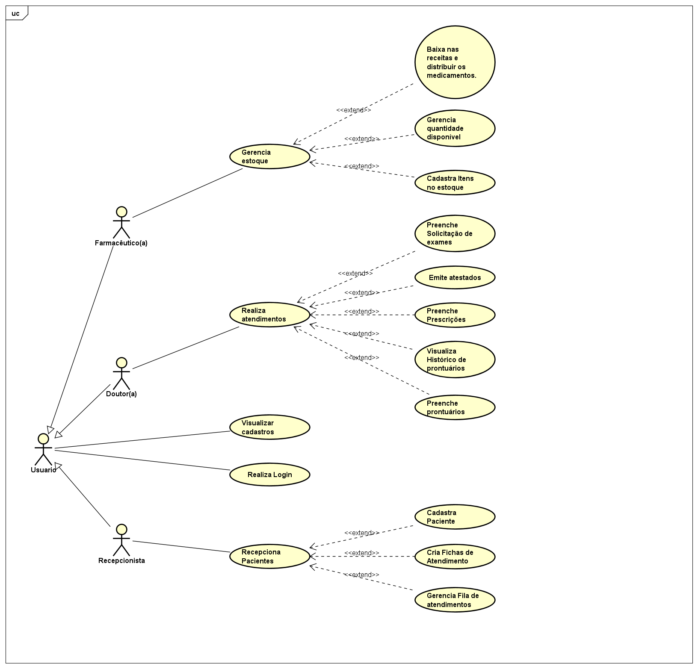

# Especificações do Projeto

Pré-requisitos: <a href="1-Documentação de Contexto.md"> Documentação de Contexto</a>

Definição do problema e ideia de solução a partir da perspectiva do usuário. É composta pela definição do  diagrama de personas, histórias de usuários, requisitos funcionais e não funcionais além das restrições do projeto.

Apresente uma visão geral do que será abordado nesta parte do documento, enumerando as técnicas e/ou ferramentas utilizadas para realizar a especificações do projeto

## Personas
|   | **Mariana Souza** |
| --- | --- |
| **Idade:** 28 | **Ocupação:** Estudante |
| **Perfil:** Estudante que encontrou no sistema do SUS uma forma mais acessível de cuidar da saúde. Acompanha o estoque de medicamentos   e solicita resultados exames sem sair de casa, o que é especialmente útil para sua intensa rotina de estudos. |
| **Motivações:**. Acompanha o estoque de medicamentos e resultados de exames . |

| ![João Silva]  . | **João Silva** |
| --- | --- |
| **Idade:** 50 | **Ocupação:** Comerciante |
| **Perfil:** Comerciante satisfeito com o sistema SUS. A funcionalidade de visualizar a fila de atendimento permite que planeje sua ida ao posto de saúde de forma eficiente, evitando longas esperas e ganhando mais controle sobre seu tempo. |
| **Motivações:** Visualizar fila de atendimento, Planejar ida ao posto de saúde. |
| 

|  | **Fernanda Oliveira** |
| --- | --- |
| **Idade:** 55 | **Ocupação:** Aposentada |
| **Perfil:** Aposentada preocupada com a saúde. O sistema SUS proporcionou a comodidade de verificar os resultados dos exames sem sair de casa, facilitando significativamente sua vida. |

|  | **Rafael Oliveira** |
| --- | --- |
| **Idade:** 45 | **Ocupação:** Médico |
| **Perfil:** Médico que encontrou no sistema do SUS uma maneira flexíviel para ver e solicitar dados dos seus pacientes |
| **Motivações:** Forma rapida e eificaz sobre os dados do paciente . |
| **Motivações:** Verificar resultados de exames online, Facilidade e comodidade na gestão da saúde. |
| 
> **Links Úteis**:
> - [Rock Content](https://rockcontent.com/blog/personas/)
> - [Hotmart](https://blog.hotmart.com/pt-br/como-criar-persona-negocio/)
> - [O que é persona?](https://resultadosdigitais.com.br/blog/persona-o-que-e/)
> - [Persona x Público-alvo](https://flammo.com.br/blog/persona-e-publico-alvo-qual-a-diferenca/)
> - [Mapa de Empatia](https://resultadosdigitais.com.br/blog/mapa-da-empatia/)
> - [Mapa de Stalkeholders](https://www.racecomunicacao.com.br/blog/como-fazer-o-mapeamento-de-stakeholders/)
>
Lembre-se que você deve ser enumerar e descrever precisamente e personalizada todos os clientes ideais que sua solução almeja.

## Histórias de Usuários

|EU COMO... `Estudante`| QUERO/PRECISO ... `Acompanhar Medicamentos e Resultados de Exames` |PARA ... `Facilitar a gestão da minha saúde e otimizar meu tempo de estudos.`                 |
|--------------------|------------------------------------|----------------------------------------|
|EU COMO... `Comerciante`| QUERO/PRECISO ... `Visualizar Fila de Atendimento no Posto de Saúde` |PARA ... `Planejar minha ida de forma eficiente, evitar longas esperas e ganhar mais controle sobre meu tempo, atendendo minhas obrigações profissionais.`                 |
|--------------------|------------------------------------|----------------------------------------|
|EU COMO... `Aposentada`| QUERO/PRECISO ... `Verificar Resultados de Exames Online` |PARA ... `Ter mais comodidade e facilidade na gestão da minha saúde, evitando deslocamentos desnecessários e agilizando o processo.`                 |
|--------------------|------------------------------------|----------------------------------------|
|EU COMO... `Médico`| QUERO/PRECISO ... `Acesso Rápido aos Dados dos Pacientes` |PARA ... `Garantir um atendimento de qualidade, tomar decisões baseadas em informações precisas e contribuir para o cuidado e bem-estar dos meus pacientes.`                 |
|--------------------|------------------------------------|----------------------------------------|
|EU COMO... `Usuário do Sistema`| QUERO/PRECISO ... `Registrar Minhas Tarefas` |PARA ... `Não esquecer de fazê-las.`                 |
|--------------------|------------------------------------|----------------------------------------|
|EU COMO... `Administrador`| QUERO/PRECISO ... `Alterar Permissões` |PARA ... `Permitir que possam administrar contas.`                 |

> **Links Úteis**:
> - [Histórias de usuários com exemplos e template](https://www.atlassian.com/br/agile/project-management/user-stories)
> - [Como escrever boas histórias de usuário (User Stories)](https://medium.com/vertice/como-escrever-boas-users-stories-hist%C3%B3rias-de-usu%C3%A1rios-b29c75043fac)
> - [User Stories: requisitos que humanos entendem](https://www.luiztools.com.br/post/user-stories-descricao-de-requisitos-que-humanos-entendem/)
> - [Histórias de Usuários: mais exemplos](https://www.reqview.com/doc/user-stories-example.html)
> - [9 Common User Story Mistakes](https://airfocus.com/blog/user-story-mistakes/)

## Modelagem do Processo de Negócio 

### Análise da Situação Atual

Apresente aqui os problemas existentes que viabilizam sua proposta. Apresente o modelo do sistema como ele funciona hoje. Caso sua proposta seja inovadora e não existam processos claramente definidos, apresente como as tarefas que o seu sistema pretende implementar são executadas atualmente, mesmo que não se utilize tecnologia computacional. 

### Descrição Geral da Proposta

Apresente aqui uma descrição da sua proposta abordando seus limites e suas ligações com as estratégias e objetivos do negócio. Apresente aqui as oportunidades de melhorias.

### Processo 1 – NOME DO PROCESSO

Apresente aqui o nome e as oportunidades de melhorias para o processo 1. Em seguida, apresente o modelo do processo 1, descrito no padrão BPMN. 

### Processo 2 – NOME DO PROCESSO

Apresente aqui o nome e as oportunidades de melhorias para o processo 2. Em seguida, apresente o modelo do processo 2, descrito no padrão BPMN.

## Indicadores de Desempenho

Apresente aqui os principais indicadores de desempenho e algumas metas para o processo. Atenção: as informações necessárias para gerar os indicadores devem estar contempladas no diagrama de classe. Colocar no mínimo 5 indicadores. 

Usar o seguinte modelo: 

Obs.: todas as informações para gerar os indicadores devem estar no diagrama de classe a ser apresentado a posteriori. 

## Requisitos

As tabelas que se seguem apresentam os requisitos funcionais e não funcionais que detalham o escopo do projeto. Para determinar a prioridade de requisitos, aplicar uma técnica de priorização de requisitos e detalhar como a técnica foi aplicada.

### Requisitos Funcionais

|ID    | Descrição do Requisito  | Prioridade |
|------|-----------------------------------------|----|
|RF-001| O aplicativo deve possibilitar autenticação do usuário | ALTA | 
|RF-002| O aplicativo deve possibilitar o cadastramento de pacientes | ALTA |
|RF-003| O aplicativo deve possibilitar a criação de fichas de atendimento | ALTA |
|RF-004| O Aplicativo deve permitir ao usuário gerenciar os atendimentos criados, dispondo os mesmos em uma fila de atendimento com funcionalidades de conclusão e cancelamento de atendimento | ALTA |
|RF-005| O aplicativo deve permitir ao usuário consultar e editar cadastros de pacientes | ALTA |
|RF-006| O aplicativo deve possibilitar ao usuário a criação/preenchimento de um prontuário de atendimento | ALTA |
|RF-007| O aplicativo deve permitir uma visualização do histórico de atendimentos passados de um paciente | MÉDIA |
|RF-008| O aplicativo deve permitir a emissão de prescrições médicas | MÉDIA |
|RF-009| O aplicativo deve permitir a emissão de atestados médicos | MÉDIA |
|RF-010| O aplicativo deve possuir cadastro de inventário de medicamentos da farmácia da UBS/Hospital | MÉDIA |
|RF-011| O aplicativo deve permitir ao usuário controlar o estoque de medicamentos (adicionar/deduzir quantidade disponível, cadastrar novos medicamentos) | MÉDIA |
|RF-012| A funcionalidade de prescrições deve se integrar com o estoque de medicamentos da UBS/Hospital, para que o usuário possa consultar a disponibilidade de um medicamento qualquer no mesmo | MÉDIA |

### Requisitos não Funcionais

|ID     | Descrição do Requisito  |Prioridade |
|-------|-------------------------|----|
|RNF-01| O sistema deve ser intuitivo e fácil de usar para todos os usuários, independentemente de sua experiência com tecnologia. | ALTA |
|RNF-02| O sistema deve oferecer um desempenho rápido e responsivo, garantindo uma experiência fluida para os usuários em todas as interações. | ALTA |
|RNF-03| A segurança das informações pessoais dos clientes deve ser prioridade, garantindo proteção adequada dos dados armazenados. | ALTA |
|RNF-04| Deve ser disponibilizado suporte eficiente para resolver problemas técnicos e questões relacionadas ao serviço de forma rápida e eficaz. | ALTA |
|RNF-05| O sistema deve estar disponível 100% do tempo, garantindo acesso ininterrupto aos usuários. | ALTA |
|RNF-06| O sistema deve apresentar uma interface amigável e atraente, proporcionando uma experiência de uso agradável aos usuários. | ALTA |
|RNF-07| Deve ser assegurada a compatibilidade com os principais navegadores web, como Chrome, Firefox, Safari e Edge, para garantir uma experiência consistente para todos os usuários. | MÉDIA |
|RNF-08| O tempo de carregamento inicial do sistema, após o usuário iniciar a aplicação, não deve exceder 15 segundos, proporcionando uma experiência inicial ágil. | ALTA |
|RNF-09| O sistema deverá se comunicar de forma eficiente com o banco de dados MongoDB e MySQL, garantindo uma operação suave e eficaz da aplicação. | ALTA |

## Restrições

O projeto está restrito pelos itens apresentados na tabela a seguir.

|ID| Restrição                                             |
|--|-------------------------------------------------------|
|01| O projeto deverá ser entregue até o final do semestre. |
|02| Orçamentárias: Disponibilidade limitada de recursos financeiros para o desenvolvimento, implementação e manutenção do sistema. |
|03| Tecnológicas: Necessidade de compatibilidade com sistemas já existentes no SUS, além da infraestrutura de TI disponível nos postos de saúde. |
|04| Operacionais: O sistema deve ser intuitivo e fácil de usar para garantir sua adoção pelos profissionais de saúde, considerando os diferentes níveis de familiaridade com tecnologia. |
|05| Legais e de Privacidade: O sistema deve estar em conformidade com a legislação brasileira sobre proteção de dados (LGPD) e outras regulamentações de saúde. |
|06| Temporais: O projeto deve ser concluído dentro de um prazo estabelecido para atender às necessidades urgentes de melhoria do atendimento à saúde. |
|07| Recursos Humanos: Limitações na disponibilidade de profissionais qualificados para o desenvolvimento, implementação e treinamento no uso do novo sistema. |

Enumere as restrições à sua solução. Lembre-se de que as restrições geralmente limitam a solução candidata.

> **Links Úteis**:
> - [O que são Requisitos Funcionais e Requisitos Não Funcionais?](https://codificar.com.br/requisitos-funcionais-nao-funcionais/)
> - [O que são requisitos funcionais e requisitos não funcionais?](https://analisederequisitos.com.br/requisitos-funcionais-e-requisitos-nao-funcionais-o-que-sao/)

## Diagrama de Casos de Uso

# Matriz de Rastreabilidade

A matriz de rastreabilidade é uma ferramenta usada para facilitar a visualização dos relacionamento entre requisitos e outros artefatos ou objetos, permitindo a rastreabilidade entre os requisitos e os objetivos de negócio. 

Abaixo segue matriz de rastreabilidade de requisitos:

# Gerenciamento de Projeto

De acordo com o PMBoK v6 as dez áreas que constituem os pilares para gerenciar projetos, e que caracterizam a multidisciplinaridade envolvida, são: Integração, Escopo, Cronograma (Tempo), Custos, Qualidade, Recursos, Comunicações, Riscos, Aquisições, Partes Interessadas. Para desenvolver projetos um profissional deve se preocupar em gerenciar todas essas dez áreas. Elas se complementam e se relacionam, de tal forma que não se deve apenas examinar uma área de forma estanque. É preciso considerar, por exemplo, que as áreas de Escopo, Cronograma e Custos estão muito relacionadas. Assim, se eu amplio o escopo de um projeto eu posso afetar seu cronograma e seus custos.

## Gerenciamento de Tempo

Com diagramas bem organizados que permitem gerenciar o tempo nos projetos, o gerente de projetos agenda e coordena tarefas dentro de um projeto para estimar o tempo necessário de conclusão.

O gráfico de Gantt ou diagrama de Gantt também é uma ferramenta visual utilizada para controlar e gerenciar o cronograma de atividades de um projeto. Com ele, é possível listar tudo que precisa ser feito para colocar o projeto em prática, dividir em atividades e estimar o tempo necessário para executá-las.

## Gerenciamento de Equipe

O gerenciamento adequado de tarefas contribuirá para que o projeto alcance altos níveis de produtividade. Por isso, é fundamental que ocorra a gestão de tarefas e de pessoas, de modo que os times envolvidos no projeto possam ser facilmente gerenciados. 

## Gestão de Orçamento

O processo de determinar o orçamento do projeto é uma tarefa que depende, além dos produtos (saídas) dos processos anteriores do gerenciamento de custos, também de produtos oferecidos por outros processos de gerenciamento, como o escopo e o tempo.

Abaixo segue gerenciamento de custos do projeto:

### ORÇAMENTO
| Recurso necessários | Valor estimado |
|------------|----------------------|
| Recursos Humanos | R$ 95.000,00 |
| Hardware | R$ 7.000,00 |
| Custos operacionais | R$ 2.500,00 |
| Software | R$ 10.000,00 |
| Serviço | R$ 5.000,00 |
| TOTAL  | R$ 119.500,00 |
