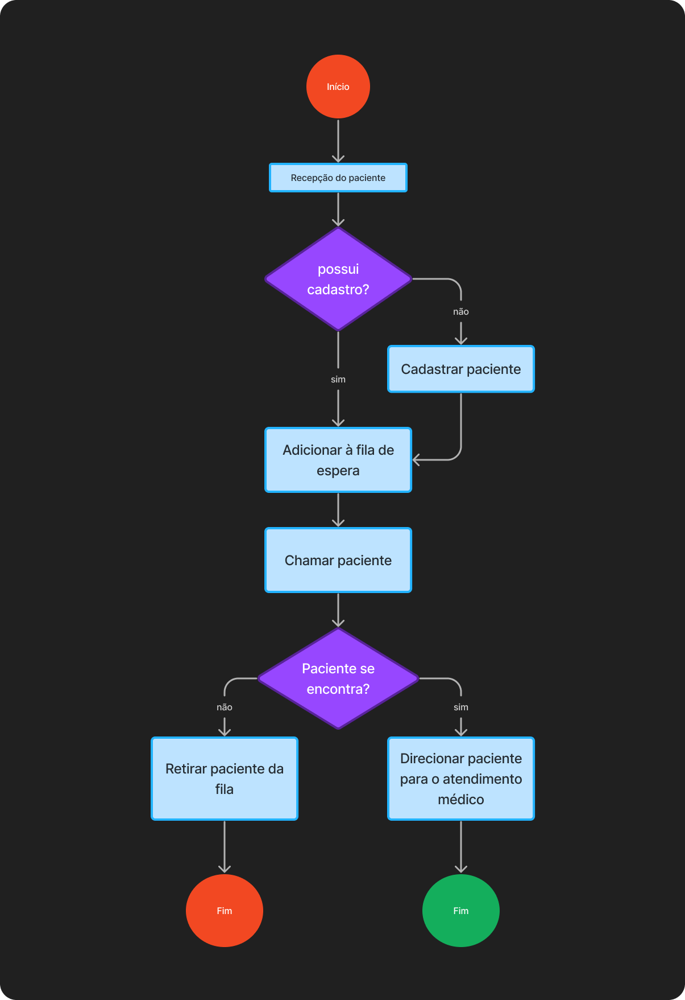
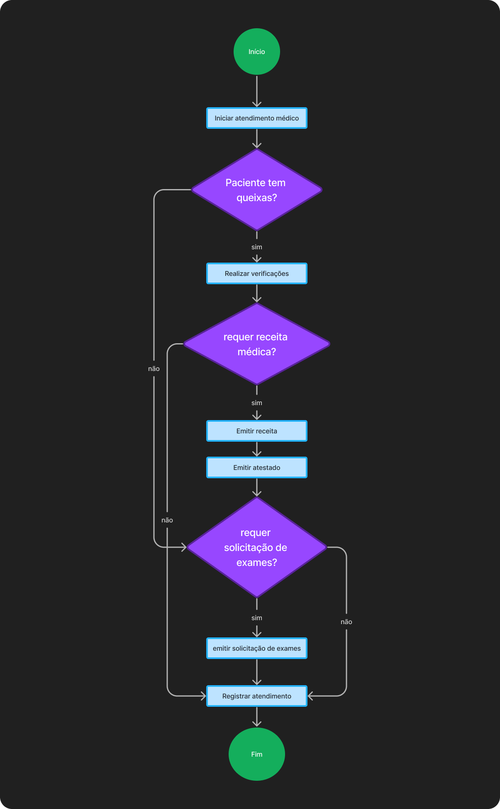
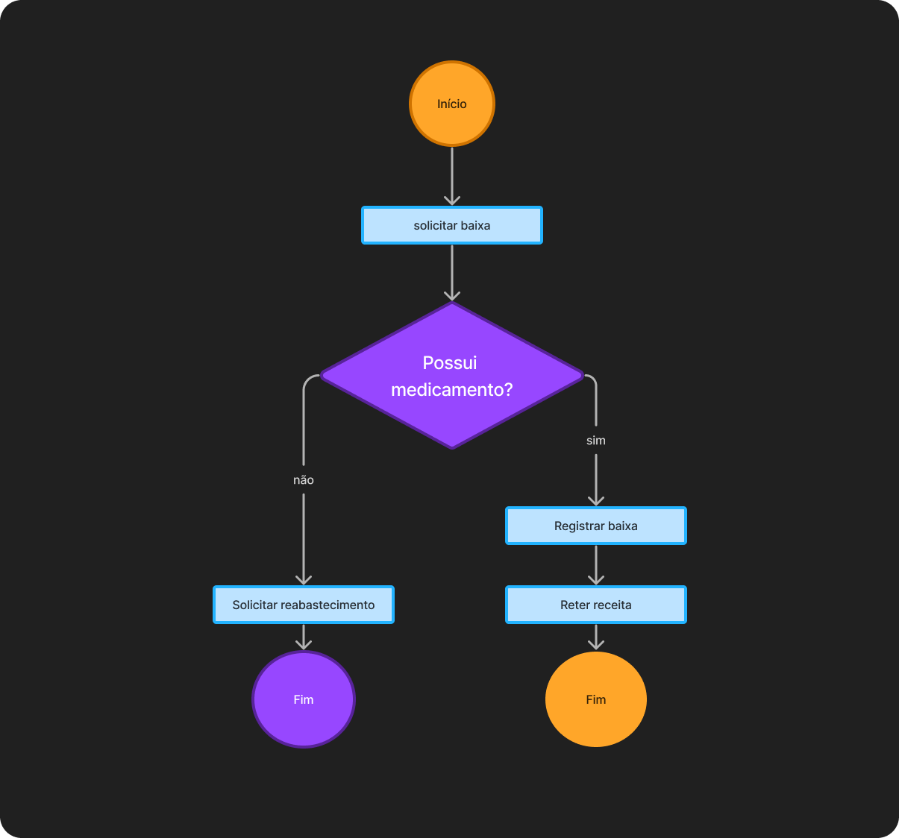
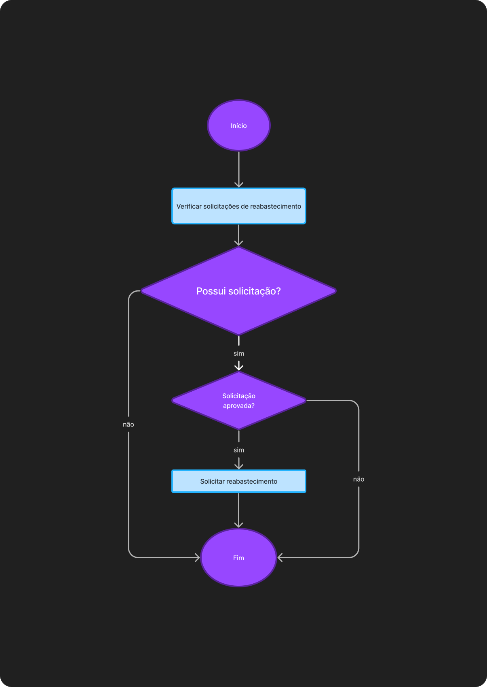

# Projeto de Interface

## Diagramas de Fluxo
### Fluxo da recepção

### Fluxo do médico(a)

### Fluxo da farmácia

### Fluxo da secretária

[Veja o nosso fluxo de telas dinâmico diretamente no Figma](https://www.figma.com/proto/eXtFcN8slkQEhD9ZuvvfAZ/DESIGN?type=design&node-id=2-1037&t=0CdsvPvFhTF9BcZC-1&scaling=min-zoom&page-id=0%3A1&starting-point-node-id=103%3A597&mode=design)

## Wireframes

> **Tela de login**:

> **Fila de atendimentos**:

> **Tela de pacientes**:

> **Modal adicionar paciente**:

> **Modal editar paciente**:

> **Tela de Visualização do paciente**:

> **Tela de atendimentos por paciente**:

> **Tela de estoque médico**:

> **Modal de adição de estoque**:

> **Modal de edição de estoque**:

