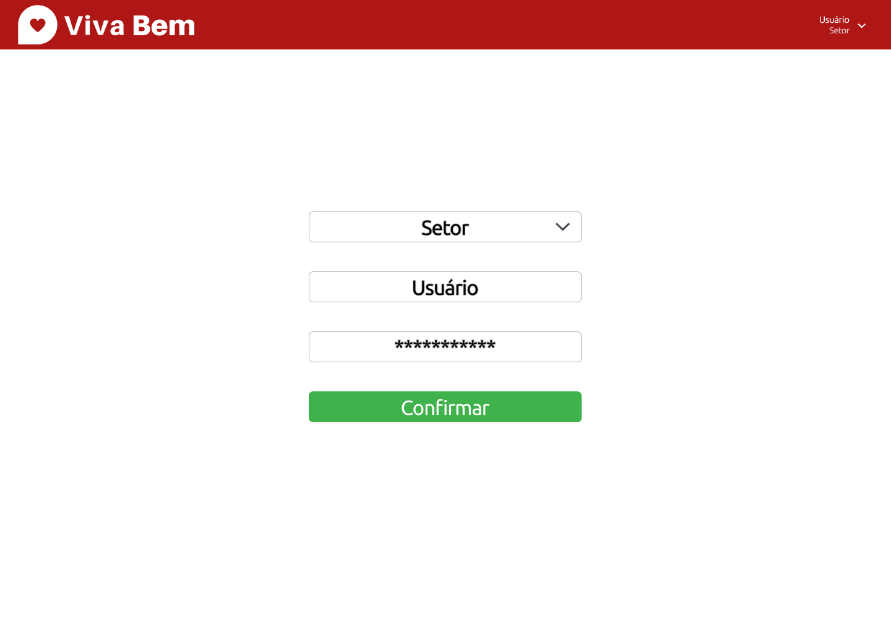
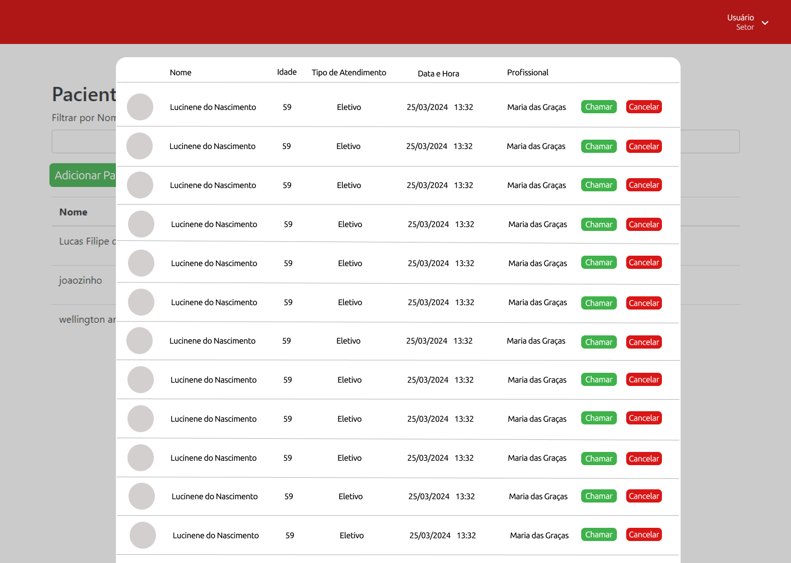
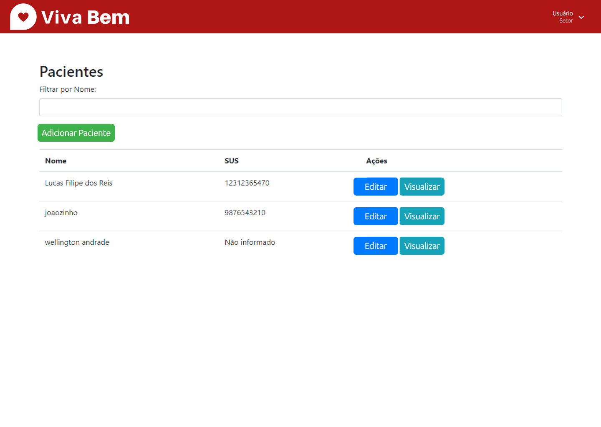
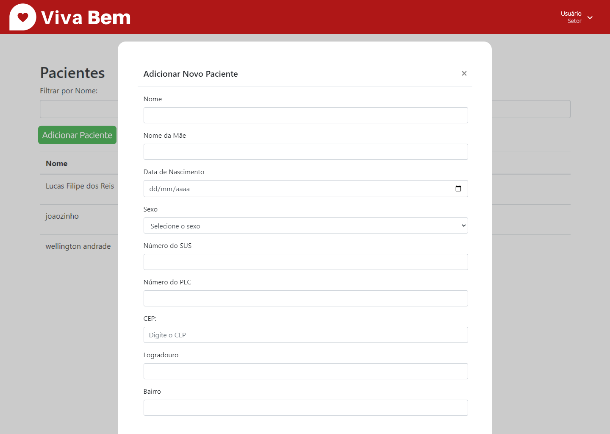
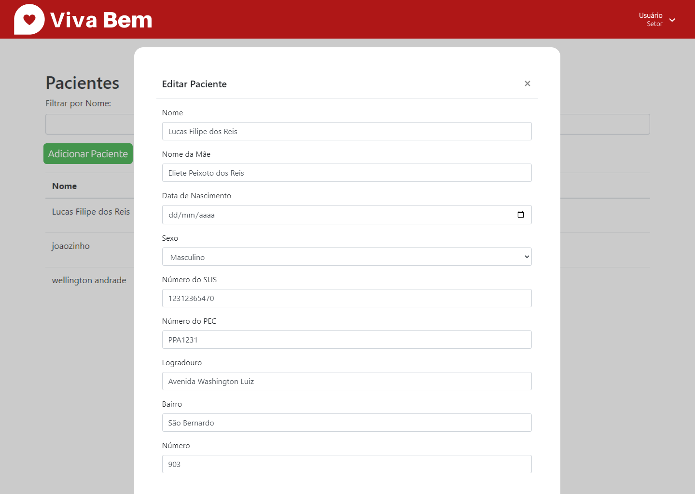
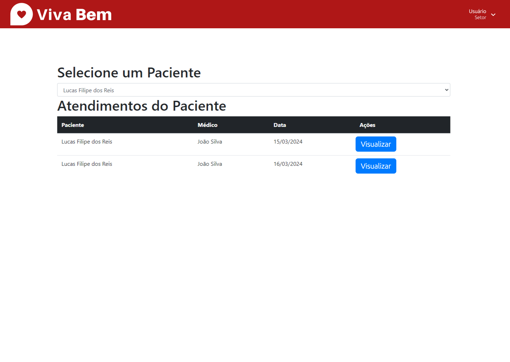
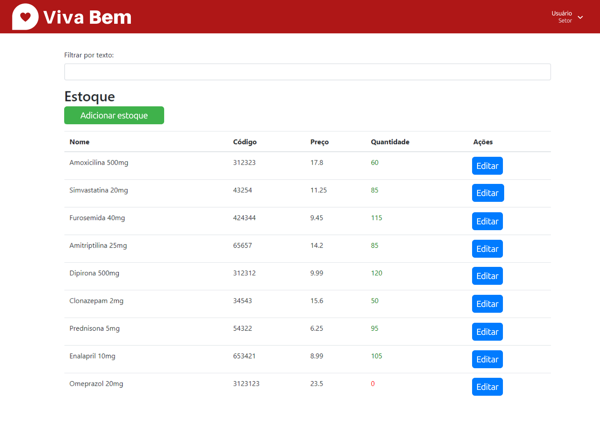
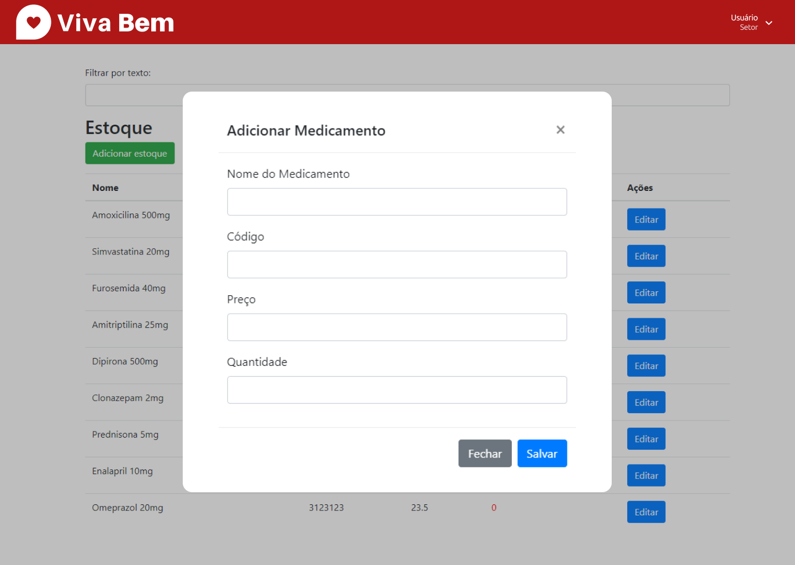
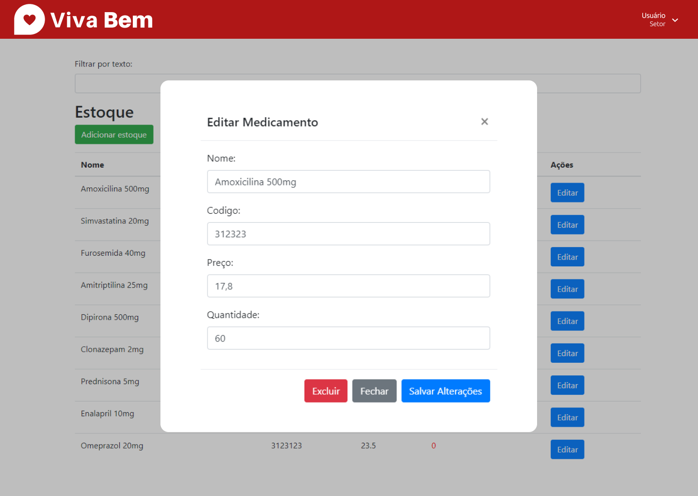

# Projeto de Interface

Pré-requisitos: <a href="2-Especificação do Projeto.md"> Documentação de Especificação</a>

Visão geral da interação do usuário pelas telas do sistema e protótipo interativo das telas com as funcionalidades que fazem parte do sistema (wireframes).

 Apresente as principais interfaces da plataforma. Discuta como ela foi elaborada de forma a atender os requisitos funcionais, não funcionais e histórias de usuário abordados nas <a href="2-Especificação do Projeto.md"> Documentação de Especificação</a>.

## Diagramas de Fluxo
[](https://mermaid.live/edit#pako:eNqVksFOwzAMhl_FCpdN6i6My4oE2tqBOIAQ48S6g5e4LNAmVZIJ0LZ3AXHgxFP0xUjXbRSQQPSS2P0_-3fkBeNaEAtZmukHPkPj4DpOFPhv5HzUap2p8p1L3W5Dp3ME_fEVcSrKt_JVg9BwiVyScjSpmf5aNFhs03BXvgBHgdYZFPp4VcsGlWw5kvkSonFfSF9foYHyGVKZIQgCsgUZnDTlF77lEuJxtClnoPjaPF43j-ogWgfDTyeCrLTVqQEdKSFzn945Gn46OvEjOtmsDwLXxiZ1TSVarROZt9tNtHZ3Oj5HDxhQ-H2UH2xN8wytjSkFqapnqKgs3Et7aeBn1PcU7nW73c298yCFm4UHxePhN7gwmpO1W3w6_QXf_4kL4tLirvk_6VTmG7KX9v4iG2y9YYF_k83wzcIwCIZbX1_y_SAK4uB0N7L_yQKWk8lRCr_Ii0qcMDejnBIW-qtAc5-wRK28DudOj54UZ6EzcwrYvBB-G2KJtwZzFqaYWZ8tUN1ovY1XH-ISCtU)

## Wireframes

> **Tela de login**:

> **Fila de atendimentos**:

> **Tela de pacientes**:

> **Modal adicionar paciente**:

> **Modal editar paciente**:

> **Tela de Visualização do paciente**:

> **Tela de atendimentos por paciente**:

> **Tela de estoque médico**:

> **Modal de adição de estoque**:

> **Modal de edição de estoque**:

